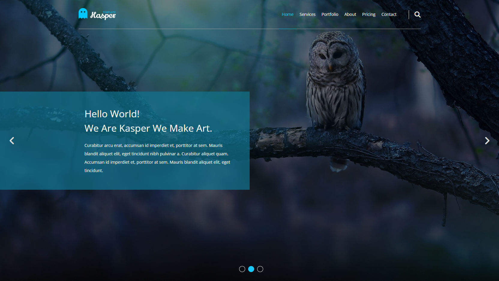

# Kasper Template

[Kasper Template](https://www.graphberry.com/item/kasper-one-page-psd-template) is a one-page PSD template designed by Graphberry. This is a HTML and CSS implementation of the design, which can be used for practicing and learning web development.

## Preview

You can see a live demo of the template [here](https://hazemhussein14.github.io/Template-2/). 

## Tutorial

If you are new to web development and want to learn more about HTML and CSS, you can check out the tutorial playlist on Elzero Web School. The tutorial walks you through the process of creating a similar template step by step.

[Kasper Playlist tutorail](https://www.youtube.com/playlist?list=PLDoPjvoNmBAy1l-2A21ng3gxEyocruT0t)

## Usage

The Kasper Template is designed to be a starting point for your own website. You can customize the template by modifying the HTML and CSS files to suit your needs. 

### HTML

The HTML file `index.html` contains the structure of the template. You can modify the HTML tags, add new sections, or remove existing ones to create your own website.

### CSS

The CSS file `kasper.css` contains the styling of the template. You can modify the CSS properties to change the colors, fonts, layout, and other visual aspects of the template. The template uses both flexbox and CSS grid for layout. FontAwesome is used for icons, and normalize.css is used to normalize the page.

### Images and Video

The `images` folder contains the images and video used in the template. You can replace these files with your own to personalize the template.

## Contributing

If you would like to contribute to the Kasper Template, you can fork the repository, make your changes, and submit a pull request.

